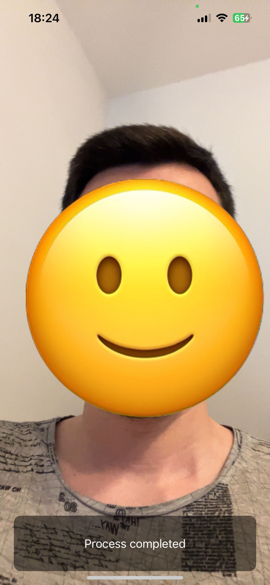

# PapilonActiveLivenessiOS-SDK

[](https://cocoapods.org/)

PapilonActiveLivenessiOS-SDK is a cutting-edge iOS SDK designed to ensure secure user authentication by accurately detecting real-time user presence, preventing spoofing and unauthorized access in critical applications.

## Getting Started
### Prerequisites

- iOS 14+

### Installation

This SDK is available through CocoaPods. Add the following line to your Podfile:

```ruby
pod 'PapilonActiveLivenessiOS-SDK'
```

Then, run the following command:

```ruby
pod install
```

## Setup PapilonIDRecognitioniOS-SDK

For the SDK to function, you require a license token. Reach out to Papilon Savunma or drop an email at yasinkoker@papilon.com.tr for the same.

Note: Ensure the safekeeping of your token as it's unique to you. In case of any discrepancies, contact Papilon Savunma with the provided licenceID.

## Usage

#### 1. Podfile Configuration

Ensure your Podfile resembles the following:

```ruby
platform :ios, '14.2'

target 'YOUR_TARGET_NAME' do
  use_frameworks! :linkage => :static
  pod 'PapilonActiveLivenessiOS-SDK'
end
```

#### 2. Camera Permission

Ensure that your application has permission to access the camera. Update your info.plist accordingly.

    <!-- Camera Usage Description -->
    <key>NSCameraUsageDescription</key>
    <string>This app requires camera access to perform id recognition.</string>

#### 3. SDK Initialization

First, import PapilonIDRecognitioniOS in your ViewController:
```swift
import UIKit
import AVFoundation
import PapilonActiveLiveness
```

Then, initialize and configure the CameraManager:
```swift
class ViewController: UIViewController, CameraManagerALDelegate {
    var cameraManagerAL: CameraManagerAL?
    
    @IBOutlet weak var previewView: UIView!
    
    override func viewDidLoad() {
        super.viewDidLoad()
        
        cameraManagerAL = CameraManagerAL()
        cameraManagerAL?.delegateCameraManagerAL = self
        cameraManagerAL?.configureALCameraManager(
          token: "<your_token>", 
          licenseID: "<license_id>",
          detectionOptions: .FullPack, 
          in: previewView)
    }
}
```

Implement CameraManagerDelegate method to handle result images:
```swift
func capturedImagesResult(_ result: [String : String]) {
    // Handle the captured images result here. For now, it's just printed to the console.
    print("Captured Images Result: \(result)")
}
```

## Example: a Complete ViewController
```swift
//
//  ViewController.swift
//  PapilonALExample
//
//  Created by yasinkoker on 27.02.2024.
//

import UIKit
import PapilonActiveLiveness

// Conforms to CameraManagerALDelegate to receive callbacks from CameraManagerAL.
class ViewController: UIViewController, CameraManagerALDelegate {

    // CameraManagerAL instance for managing camera operations and liveness detection.
    var cameraManagerAL: CameraManagerAL?
    
    // Outlet for the view where the camera preview will be displayed.
    @IBOutlet weak var previewView: UIView!

    override func viewDidLoad() {
        super.viewDidLoad()
        
        // Initialize the CameraManagerAL instance.
        cameraManagerAL = CameraManagerAL()
        // Set this ViewController as the delegate to receive camera and liveness detection events.
        cameraManagerAL?.delegateCameraManagerAL = self
        // Configure the CameraManagerAL with necessary parameters including token, licenseID, detection options, and the preview view.
        cameraManagerAL?.configureALCameraManager(
            token: "<your_token>",
            licenseID: "<license_id>",
            detectionOptions: .FullPack, // Specifies the type of liveness detection to perform.
            in: previewView // The view where the camera preview will be displayed.
        )
    }
    
    // Delegate method to receive the results of the liveness detection as a dictionary of base64-encoded images.
    // The dictionary keys indicate the type of image (e.g., "left" for left rotation).
    func capturedImagesResult(_ result: [String : String]) {
        // Handle the captured images result here. For now, it's just printed to the console.
        print("Captured Images Result: \(result)")
    }
}
```

## Example: ViewController UI
<div style="text-align:center">
    
</div>